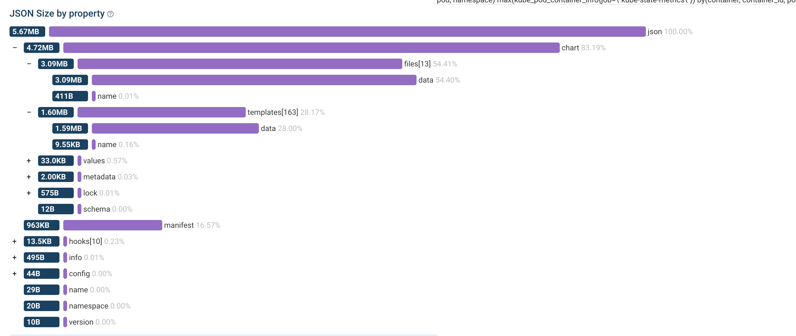

+++
date = '2025-07-09T21:12:46+02:00'
title = 'Handling the 1MB Helm Release Size Limit (from a chart maintainer’s perspective)'
description = 'Kubernetes DNS, while convenient, harbors a security risk: a lack of understanding regarding its resolution mechanisms permits attackers to redirect cluster traffic without exploits, simply by creating specific namespaces and services. Effective protection hinges on policy, strict naming conventions, controlled permissions, and egress restrictions.'
categories = ['Kubernetes']
tags = ['Kubernetes', 'Helm']
+++

Helm is a fantastic packaging and lifecycle tool—until you hit one of its hardest limits: 
```
Error: create: failed to create: Secret "sh.helm.release.v1.my-release.v1" is invalid: 
data: Too long: must have at most 1048576 bytes
```

Helm stores release state in a Kubernetes object, and Kubernetes objects have a hard 1 MiB size limit. If your chart grows large (hello, “monster CRDs”), you can end up in a situation where helm install/upgrade fails even though nothing is “wrong” with your Kubernetes cluster.

This post explains why the limit exists, how to measure what’s consuming your release size, and several maintainer-grade techniques to stay below the 1 MiB ceiling—based on a real-world experience maintaining kube-prometheus-stack, where CRDs alone can be multiple megabytes on disk.

# Why Helm releases have a size limit

Helm stores the full release information (rendered manifests, values, chart metadata, chart files, hooks, etc.) inside a Kubernetes Secret (or ConfigMap if configured). The object looks like this:

* Secret name pattern: sh.helm.release.v1.<release>.v<revision>
* Data key: .data.release
* The release payload is:
  * base64-encoded
  * gzipped (internally by Helm)
  * base64-encoded again (because Secrets store base64 strings)

Regardless of the encoding layers, the final Kubernetes Secret object must fit within Kubernetes’ 1 MiB object size limit (technically 1,048,576 bytes).

That means: a Helm release cannot exceed ~1 MiB, and the “effective” limit is often lower due to metadata overhead.

# Why CRD-heavy charts are especially affected

In the operator ecosystem, CRDs tend to grow over time. A single CRD can be huge, and a set of CRDs can be massive. Prometheus Operator is a well-known example: the CRDs can easily exceed multiple megabytes on disk.

And here’s the kicker: CRDs in Helm charts are special:

* Helm installs CRDs from the crds/ directory during install/upgrade.
* Helm generally does not manage CRDs as part of normal lifecycle (it won’t upgrade/delete them the same way as templated resources).
* Yet, depending on chart structure, the CRD files may still end up being stored in the release payload in a way that can explode the size.

So you get the worst of both worlds:

* CRDs are large
* Helm doesn’t really “manage” them
* But the release state may still contain them (sometimes effectively twice)

# Reproducing and measuring the problem

When you suspect you’re approaching the limit, don’t guess—measure.

## 1) Check the raw size of the stored release payload

```bash
kubectl get secrets sh.helm.release.v1.kube-prometheus-stack.v2 \
  -o jsonpath='{.data.release}' | base64 -d > release

ls -l release
```

In one real case (with an optional feature enabled), the stored payload was around:

* 1031276 bytes with the feature enabled
* 1025044 bytes without it

Both are dangerously close to 1,048,576 bytes.

## 2) Decode the release into JSON for analysis

```bash
kubectl get secrets sh.helm.release.v1.kube-prometheus-stack.v2 \
  -o jsonpath='{.data.release}' \
  | base64 -d | base64 -d | zcat - > release.json
```

This give us the raw JSON data of the helm release. Then I upload the data to an [json size analyser](https://www.debugbear.com/json-size-analyzer):



```bash
% jq -r '.chart.files[] | (.data | length | tostring) + ": " + .name' release.json | sort -n
532: .helmignore
876: CONTRIBUTING.md
8556: crds/crd-prometheusrules.yaml
24124: crds/crd-scrapeconfigs.yaml
47600: crds/crd-podmonitors.yaml
49656: crds/crd-probes.yaml
50024: crds/crd-servicemonitors.yaml
80636: README.md
360328: crds/crd-alertmanagerconfigs.yaml
565424: crds/crd-thanosrulers.yaml
600740: crds/crd-alertmanagers.yaml
674428: crds/crd-prometheusagents.yaml
773992: crds/crd-prometheuses.yaml
```

# Techniques to reduce release size

## Technique 1: Reduce documentation footprint (small win, but easy)

Helm stores chart files in the release, which can include:

* README.md
* CONTRIBUTING.md
* other large docs

You can exclude files via `.helmignore`, but that also removes them from the chart package (which affects ArtifactHub and users who inspect the chart archive).

**Maintainer tip**: keep README.md minimal and move bulk content into:

* USAGE.md
* UPGRADES.md

Then consider ignoring only the extra-large docs if you must—balancing:

* chart usability (docs included)
* ArtifactHub quality
* release size

This alone usually gives only small savings (single-digit KB), but it’s low-risk and easy.

## Technique 2: Minify CRDs (moderate win, higher risk)

CRDs are YAML—YAML is verbose. If you convert them to minified JSON, you can save a lot of bytes.

One example workflow:

```
for i in crds/*.yaml; do
  yq -o=json -I=0 "$i" > "${i/yaml/json}"
  rm "$i"
done
```

Would result into a much lower release size. 1031276 -> 851536 bytes

```
jq -r '.chart.files[] | (.data | length | tostring) + ": " + .name' release.json | sort -n
568: .helmignore
5656: crds/crd-prometheusrules.json
15260: crds/crd-scrapeconfigs.json
26808: crds/crd-podmonitors.json
28424: crds/crd-servicemonitors.json
29220: crds/crd-probes.json
159628: crds/crd-alertmanagerconfigs.json
321280: crds/crd-thanosrulers.json
337412: crds/crd-alertmanagers.json
385084: crds/crd-prometheusagents.json
442848: crds/crd-prometheuses.json
```

This can yield noticeable reduction. In the kube-prometheus-stack case, it saved around 17.4%, which is a huge chunk when you’re close to the limit.

**Maintainer tip**: Try to avoid this if you can. If you do it, consider:

* Tooling differences: Argo CD / Flux / other automation may behave differently depending on file format expectations and diffing behavior.
* Human factors: JSON CRDs are harder to review in PRs than YAML.
* Not all maintainers want to “fight” readability to win bytes.

## Technique 3: Move CRDs into a subchart

This is the most effective and maintainable trick I’ve seen for charts:

Move CRDs out of the root chart into a dedicated subchart, e.g.:

* Root chart: kube-prometheus-stack
* Subchart: kube-prometheus-stack-crds (e.g. `kube-prometheus-stack/charts/kube-prometheus-stack-crds/`)
Put the CRD files from `kube-prometheus-stack/crds/` into the subchart’s `kube-prometheus-stack/charts/kube-prometheus-stack-crds/crds` directory.

### Why this works

Helm has a quirky behavior: for the root chart, chart files can end up being stored in the release in a way that is disproportionately large (and can include duplication depending on internal representation). For subcharts, Helm does not persist chart files in the same way.

So by shifting CRDs into an “unmanaged CRD subchart”:

* Helm still installs CRDs on fresh installs (because they’re still in crds/)
* but the CRD files stop bloating the release Secret

This can turn a nearly-1MiB release into something comfortably small. In one case, moving CRDs to a subchart reduced the release payload from roughly: 

~1,031,276 bytes → ~392,092 bytes

That’s a dramatic reduction and gives you back upgrade headroom for future features.

## Technique 4: CRD handling through helm hooks

Some charts don’t rely purely on Helm’s built-in crds/ installation flow and instead use:

* a pre-install / pre-upgrade hook Job
* that applies CRDs with kubectl apply

This is necessary, because Helm’s built-in CRD handling is very basic and doesn’t support things like:

* CRD updates (it only installs on fresh installs)
* CRD lifecycle management (it doesn’t delete CRDs on uninstall)
* Templating CRDs (you can’t use Helm templating features in crds/)

If you do that, subchart-only may not be enough. Because the CRD files needs to be included as ConfigMap for the hook to work. While files in the crds/ directory are not included in the release, files in the templates/ directory are. So you may end up with a situation where:
* CRD files are in the root chart’s templates/ directory (to be included in the release for the hook) 
* but that causes the release size to explode
* moving them to a subchart’s templates/ directory reduces the release size, but then you need to ensure the hook can still find and apply the CRDs correctly

A pragmatic trick: store CRDs as a compressed archive in the chart, and decompress at runtime in the hook job.

### Why bother, doesn’t Helm already gzip?

Helm’s internal gzip compression applies to the release blob, but you can often get better results by pre-compressing large static assets (like CRD YAML) yourself so they occupy fewer bytes before Helm encodes them into the release state.

### Why bz2?
bz2 is surprisingly effective for large YAML/JSON CRDs. Other options have trade-offs:

* `xz` compresses better, but reproducible archives across macOS/Linux can be painful (binary-identical output matters if you want CI to rebuild and verify artifacts cleanly).
* `zstd` often isn’t available in minimal images (busybox/alpine/distroless).
* Avoiding custom images keeps maintenance simpler.

A common pattern is:
* initContainer with busybox to decompress the archive
* a kubectl container to apply CRDs

This keeps the hook job small, portable, and reproducible.

# Practical guidance: what I would recommend as a maintainer
If you maintain a chart and are hitting (or nearing) the limit:

1. Measure first (decode release, inspect .chart.files).
2. Do the structural fix:
   * Move CRDs into a dedicated subchart (biggest win, low risk).
3. Trim documentation bloat:
   * Keep README.md lean; split into USAGE.md / UPGRADES.md.
4. If you have a hook-job-based CRD installer:
   * consider shipping CRDs as a bz2 archive and decompress/apply at runtime.

This combination is usually enough even for very large CRD suites.

# Closing thoughts
The 1 MiB Kubernetes object limit isn’t going away—and Helm releases live inside Kubernetes objects. So for chart maintainers, the right mindset is:

* treat release size as a real constraint
* assume CRDs will grow
* design chart structure so CRDs don’t bloat the release state

* If you maintain operator-style charts, you’ll likely hit this sooner or later. The good news: with a few structural tricks (especially the subchart approach), you can keep your releases healthy and future-proof without sacrificing UX or maintainability.
